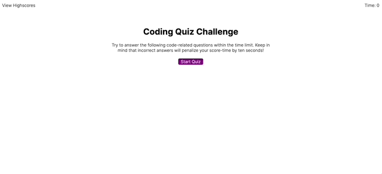

# code-quiz

The objective of this homework was to get a feel for a real life coding assessment. The task was to build a timed coding quiz with multiple choice questions. The app runs in the browser and features dynamically updated HTML and CSS powered by JS code. The interface is clean and user friendly styled with CSS. 

For this assignment I took it piece by piece to make it easier to accomplish. I started with the index.html file to create the homepage which prompts the user to start the quiz. Then I worked on the CSS file to get everything styled and aligned to resemble the mock-up. Next I created a JS file that stores the questions, choices, and answers. Then I created the main JS file that brings the user through the questions and gives them feedback. It also controls the timer and saves the users score. Next I established a JS file to keep each users score and also a function that lets the user clear the score board if they chose. Finally I created the score HTML file to actually display the scores and let the user chose if they want to go back to take the quiz again or if they want to clear the score board. 

[code-quiz live link](https://masonfibkins.github.io/code-quiz/index.html)

